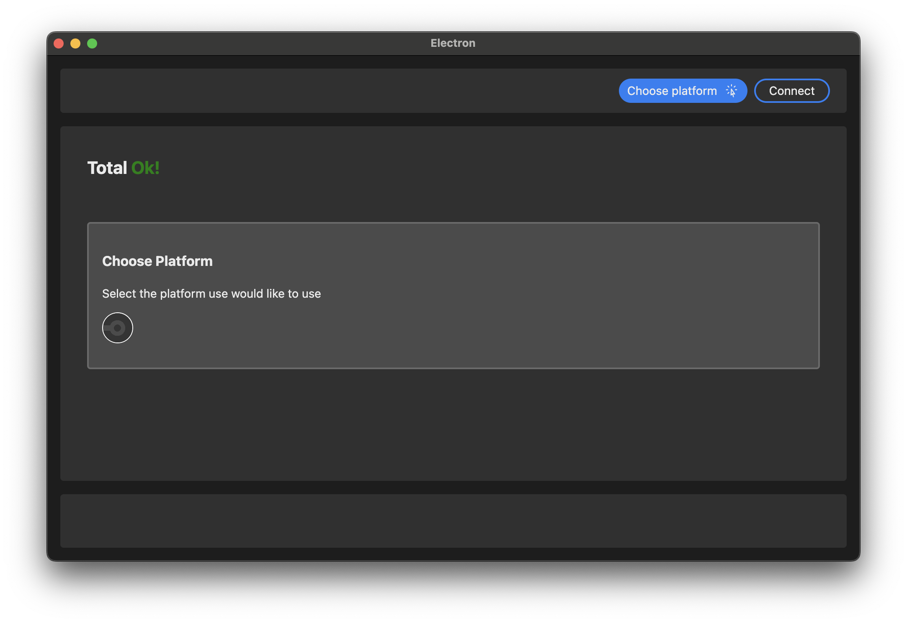

# Workflow watcher

### Идея

Создать устройство, которые будет 24/7 показывать последний статус пайпланов и выводить полезную информацию по типу сообщения коммита и автора

### Текущий флоу

1. Юзер получает заранее прошитое устройство без id
2. Скачивает приложение
3. Подключать устройство и проходит первую настройку, выдает устройству ключи до CI подключает устройство к интернету
4. Устройство при первом подключении получает UUID и это является его уникальным токеном с которым он в дальнейшим ходит на backend за данными
5. Далее устройство можно отключить от компьютера

### Текущие Состояние
В рамках хакатона хочется потрогать новые технологии по этому backend будет писаться на Hono, а front на electron

#### Electron APP
Задача приложения сводится к настройкам запросов к CI и первичная регистрация устройства

В остальное время приложение не требуется для настройки девайса, но в приложении так же можно посмотреть состояние CI

#### Backend
Backend этого проекта представляет собой адаптер, который может сходить к различным CI и предоставить данные микроконтроллеру в удобном для его формате

Почему было решено писать Backend, а не просто кидать запросы с устройства?

Память микроконтроллера сильно ограничена и патчить устройство ради каждого нового провайдера данных мне показалось не очень правильным решением

Когда мы добавляем новый адаптер к новому провайдеру мне не требуется патчить устройство, мы просто выводить пользователю, что появился новый провайдер, вы можете вставить свой токен и сразу начать получать новый данные

#### Микроконтроллер
Взяли esp-32 по принципу, что лежало дома

Основная задача, получить ID на устройство, начать делать запросы на backend, получать данные и выводить их на маленький экран (был взят по тому же принципу) на текущий момент решение выглядит крайне простым, а главное позволяет в теории писать адаптеры, которые никак не будут связаны с CI, например выводить цены на рыночные активы или health check status aidbox'а 

Плюсы: Из коробки Wifi модуль, поддержка arduino

Минусы: Ардуино
