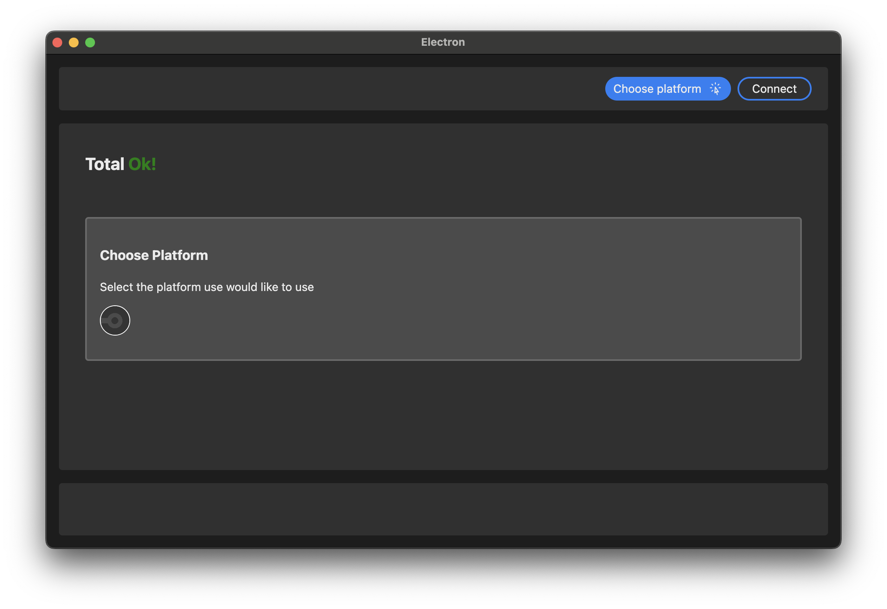

# Workflow Watcher

A small desk device that shows the status of your CI pipelines, 24/7, without a browser
tab open. It displays the last run's result along with the commit message and author.

Built over a hackathon in June 2024.



---

## How it fits together

Three pieces:

```
  ESP32 + OLED  ──HTTP──>  Hono backend  ──>  GitHub Actions / GitLab / …
   (device/)               (backend/)              CI providers
        ▲
        │ USB serial, first-run setup only
        │
   Electron app
   (electron/)
```

**[`device/`](device)** — an ESP32 driving a 128×64 SSD1306 OLED over I²C. It stores its
identity in `Preferences`, polls the backend, and renders what comes back. It speaks a
tiny serial command protocol (`ID`, `GET_NAME`, `GET_WIFI_STATUS`) that the desktop app
uses during setup, and holds up to 20 provider slots, each carrying a status, a message
and an author.

**[`backend/`](backend)** — Hono on Node with Postgres. This is the adapter layer: it talks
to each CI provider's API and hands the device one small, uniform payload. Auth is
Lucia + JWT, request validation is zod, migrations are dbmate.

**[`electron/`](electron)** — the desktop app. Used once to register the device, pass it
CI credentials and put it on WiFi; after that the device runs on its own. The app also
shows pipeline status if you happen to have it open.

## The setup flow

1. You get a pre-flashed device with no identity.
2. Install the desktop app.
3. Plug the device in. The app walks first-run setup, hands over the CI keys, and joins it
   to WiFi.
4. On first connection the device receives a UUID, which becomes the token it uses for
   every later request to the backend.
5. Unplug it from the computer. It is independent from here.

## Why a backend instead of calling the CI providers from the device

The obvious design is to let the microcontroller call the CI APIs directly and skip the
server entirely. We didn't, for one reason: **a microcontroller has very little memory, and
adding a provider would mean reflashing every device in the field.**

With an adapter in front, adding a provider is a server-side change. Existing devices pick
it up with no firmware update — the user is simply offered a new provider, pastes a token,
and data starts arriving.

The same property makes the device not really a CI display at all. Anything that can be
reduced to *status + short message + author* fits the existing payload, so an adapter could
just as easily push market prices or a service's health-check state to the same screen.

## Stack

TypeScript · Hono · PostgreSQL · Electron · Vite · ESP32 (Arduino) · Docker Compose

Hono and Electron were both deliberate choices: neither had been used on a shipped
project before, and a hackathon is the cheapest place to find out what a tool is like.

---

## Running it

```bash
docker compose up -d           # Postgres

cd backend && npm install
cp .env.tpl .env               # fill in
npm run dev

cd ../electron && npm install
cp .env.tpl .env
npm run dev
```

Flash [`device/main/main.ino`](device/main/main.ino) to an ESP32 with the Arduino IDE.
Needs the `Adafruit_GFX` and `Adafruit_SSD1306` libraries, and an SSD1306 OLED wired to
I²C at address `0x3C`.
